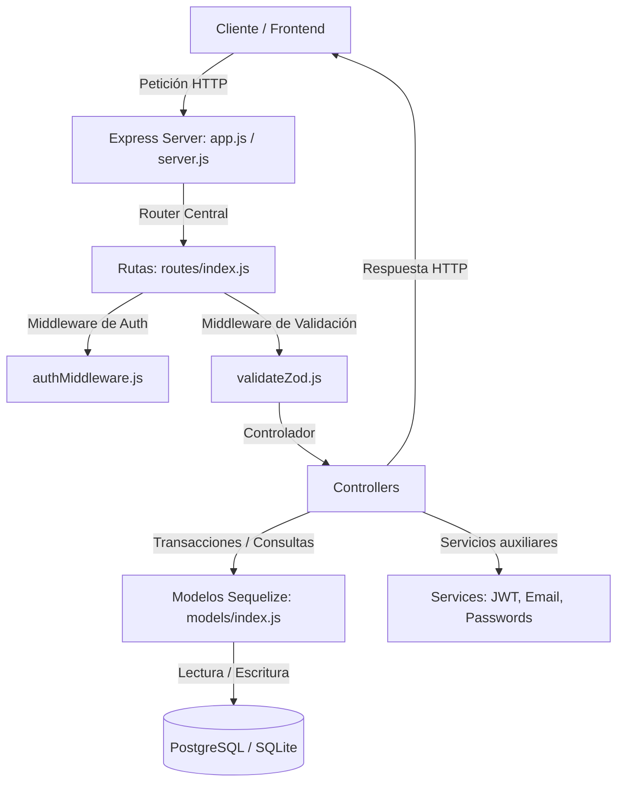

# Plan de Trabajo: Creación de Backend Express, Sequelize & PostgreSQL desde Cero

Este documento presenta una guía paso a paso detallada del diseño y la implementación de un backend robusto basado en **Node.js, Express, Sequelize y PostgreSQL/SQLite**. Está diseñado específicamente para servir como guía o *prompt* estructurado para que otra IA pueda replicar o generar este backend en otro proyecto de manera precisa.

---

## 🗺️ Arquitectura General
El backend está estructurado bajo un patrón de diseño **MVC (Modelo-Vista-Controlador)** desacoplado, complementado con validaciones estrictas en tiempo de ejecución, una capa unificada de servicios y un manejador central de excepciones.



---

## 📁 Estructura del Proyecto
La estructura de archivos recomendada para mantener el código modular y escalable es:

```text
/backend
├── .env.example                # Variables de entorno de muestra
├── package.json                # Dependencias y scripts del proyecto
├── jest.config.js              # Configuración de pruebas (Jest)
├── test-emails.js              # Script de prueba manual para EmailJS/SMTP
├── patches/                    # Parches para solucionar problemas de dependencias
│   └── @apidevtools+json-schema-ref-parser+9.1.2.patch
├── postman/                    # Archivos JSON de colecciones de Postman para testing
├── tests/                      # Utilidades de inspección y migración manual de base de datos
├── test/                       # Pruebas unitarias de esquemas y lógica de recuperación con Jest
├── src/
│   ├── server.js               # Punto de entrada (inicializa DB y levanta servidor)
│   ├── app.js                  # Configuración de Express, middlewares y rutas
│   ├── config/
│   │   ├── env.js              # Validación con Joi e importación de variables .env
│   │   └── database.js         # Configuración del pool de conexión a base de datos (Postgres/SQLite)
│   ├── models/
│   │   ├── index.js            # Inicialización de Sequelize y definición de relaciones (FKs)
│   │   └── [domain_model].js   # Modelos individuales (e.g. user.js, career.js, student.js)
│   ├── controllers/
│   │   └── [domain]Controller.js # Lógica de negocio y manejo de peticiones HTTP
│   ├── routes/
│   │   ├── index.js            # Enrutador principal que agrupa las rutas
│   │   └── [domain]Routes.js   # Rutas específicas para cada modelo con comentarios Swagger
│   ├── middlewares/
│   │   ├── authMiddleware.js   # Protección de rutas con tokens JWT
│   │   ├── validateZod.js      # Middleware genérico de validación Zod
│   │   └── errorHandler.js     # Manejo unificado de errores y códigos de estado HTTP
│   ├── validators/
│   │   ├── commonSchemas.js    # Esquemas Zod reutilizables (IDs, UUIDs, paginación)
│   │   └── domainSchemas.js    # Esquemas de validación de negocio para peticiones POST/PUT
│   ├── services/
│   │   ├── passwordService.js  # Encriptación de contraseñas
│   │   ├── jwtService.js       # Firma y validación de tokens de sesión
│   │   ├── emailService.js     # Envío de correos por transporte unificado (SMTP o EmailJS)
│   │   └── passwordRecoveryService.js # Lógica de tokens y URLs para restablecer contraseñas
│   └── docs/
│       └── swagger.js          # Configuración de la documentación Swagger/OpenAPI
```

---

## 🚀 Guía de Implementación Paso a Paso

### Paso 1: Configuración del Entorno y Dependencias
1. Inicializar el proyecto con `npm init -y`.
2. Modificar el `package.json` agregando los scripts necesarios (`start`, `dev` con `nodemon`, y `test`).
3. Instalar las dependencias core y dev:
   - **Dependencias del Sistema**: `express`, `cors`, `helmet`, `morgan`, `dotenv`, `joi`, `zod`, `jsonwebtoken`, `sequelize`, `pg`, `pg-hstore`, `nodemailer`, `@emailjs/nodejs`, `swagger-ui-express`, `swagger-jsdoc`.
   - **Dependencias de Desarrollo**: `nodemon`, `jest`, `supertest`, `sqlite3` (para base de datos en memoria en pruebas).

### Paso 2: Validación de Variables de Entorno con Joi
Implementar un validador en `src/config/env.js` que fuerce al backend a fallar inmediatamente en el arranque si faltan variables cruciales.
- Usar `dotenv` para cargar el archivo `.env` o `.env.test`.
- Definir un esquema `Joi` para variables como `PORT`, `NODE_ENV`, `DB_ENV`, credenciales de base de datos locales/remotas, secretos JWT y parámetros de correos.
- Exportar un objeto de configuración plano limpio.

### Paso 3: Pool de Conexión a Base de Datos (Postgres & SQLite)
Crear `src/config/database.js` para administrar la conexión ORM:
- Soportar dialecto `sqlite` en memoria (`:memory:`) cuando el entorno de ejecución sea `test`.
- Soportar conexiones remotas mediante URI (`DB_URI_REMOTE`) o locales parametrizadas por partes.
- **Configuración Crítica**: Detectar si el host de destino (e.g. Neon, Supabase) requiere SSL dinámico y configurarlo usando `dialectOptions: { ssl: { require: true, rejectUnauthorized: false } }`.
- Exportar la instancia de `sequelize` y una función auxiliar `testConnection()` que realice un `sequelize.authenticate()`.

### Paso 4: Capa de Modelado de Datos (Sequelize ORM)
1. **Modelos Modulares**: Crear archivos individuales por tabla (e.g. `user.js`, `role.js`) que exporten una función factory `(sequelize, DataTypes)` y retornen el modelo con su nombre de tabla y validaciones nativas de Sequelize.
2. **Índice de Modelos (`src/models/index.js`)**:
   - Cargar todas las fábricas pasándole la instancia de Sequelize.
   - Declarar explícitamente todas las relaciones y claves foráneas (`hasMany`, `belongsTo`, `hasOne`). Por ejemplo:
     ```javascript
     Role.hasMany(User, { foreignKey: 'id_role' });
     User.belongsTo(Role, { foreignKey: 'id_role' });
     ```
   - Exportar los modelos listos para consultar.

### Paso 5: Servicios de Utilidad y Seguridad
Implementar lógica desacoplada en la carpeta `services/`:
1. **Password Service**: Utilizar criptografía nativa de Node o bcrypt para hashear (`hashPassword`) y validar (`verifyPassword`) contraseñas.
2. **JWT Service**: Funciones para firmar (`signAccessToken`) y verificar (`verifyAccessToken`) tokens, así como para extraer el token del encabezado HTTP Bearer.
3. **Email Service**: Implementar una interfaz unificada `sendEmail`. Dependiendo de `EMAIL_TRANSPORT` (`log` | `smtp` | `emailjs`), debe escribir en consola, enviar correos vía SMTP utilizando `nodemailer`, o disparar una petición HTTPS externa mediante `@emailjs/nodejs` con sus respectivas plantillas.
4. **Password Recovery Service**: Generación de URLs seguras que contengan tokens firmados temporalmente (`purpose: 'password-reset'`), plantillas HTML de recuperación y lógica para actualizar la contraseña una vez validados dichos tokens.

### Paso 6: Middleware de Validación de Esquemas con Zod
1. **Esquemas Comunes (`commonSchemas.js`)**: Definir reglas reusables como enteros positivos, UUIDs válidos, formato de fechas ISO (`YYYY-MM-DD`) y esquemas de paginación básica.
2. **Esquemas de Negocio (`domainSchemas.js`)**: Crear validaciones estrictas para el cuerpo, parámetros y consultas de cada endpoint (creación, login, actualización parcial).
3. **Middleware Genérico (`validateZod.js`)**:
   - Una función de orden superior que reciba los esquemas para `body`, `query` o `params`.
   - Ejecutar el parseo de Zod y reasignar los campos validados y saneados de vuelta al objeto `req`.
   - Capturar errores de validación y propagarlos mediante `next(error)`.

### Paso 7: Manejo Centralizado de Excepciones
Implementar `src/middlewares/errorHandler.js` para interceptar todos los errores del flujo:
- Capturar errores de sintaxis JSON en peticiones HTTP (HTTP 400).
- Traducir los errores estructurados de `Zod` a respuestas JSON con los campos fallidos y sus mensajes explicativos.
- Capturar expiraciones de firmas JWT (`TokenExpiredError` -> HTTP 401).
- Capturar errores de restricción de integridad de base de datos de Sequelize (`ValidationError` -> HTTP 400).
- Manejar excepciones genéricas devolviendo HTTP 500 y ocultando la pila de llamadas (*stacktrace*) en producción.
- Middleware complementario `notFound` para manejar rutas inexistentes devolviendo HTTP 404.

### Paso 8: Controladores REST Modulares
Escribir la lógica en controladores (e.g. `careerController.js`).
- Diseñar funciones para el estándar CRUD (`list`, `get`, `create`, `update`, `remove`).
- **Transaccionalidad**: En flujos que involucren inserciones múltiples o dependientes (e.g. registrar usuario + crear estudiante), usar transacciones administradas por Sequelize para asegurar la atomicidad (`const t = await sequelize.transaction()`).
- Devolver respuestas HTTP consistentes (e.g. HTTP 201 en creación, HTTP 204 en eliminación, HTTP 200 en lecturas exitosas).

### Paso 9: Capa de Rutas y Middleware de Autorización
1. **Filtro de Autenticación (`authMiddleware.js`)**: Middleware `requireAuth` que extrae el token Bearer, lo valida, guarda el payload en `req.auth` y da paso con `next()`. Si falla, interrumpe el flujo devolviendo HTTP 401.
2. **Rutas por Dominio**:
   - Asociar métodos HTTP (GET, POST, PUT, DELETE) con su respectivo esquema de validación y controlador.
   - Ejemplo:
     ```javascript
     router.post('/register', validateZod({ body: authRegisterSchema }), authController.register);
     ```
3. **Swagger Specs**: Agregar comentarios en formato JSDoc (`@openapi` o `@swagger`) directamente encima de las rutas detallando los parámetros, peticiones, respuestas y códigos de estado.
4. **Router Unificado (`routes/index.js`)**: Agrupar todos los submódulos de rutas en un solo enrutador de Express bajo el prefijo `/api`.

### Paso 10: Inicialización y Servidor Principal
1. **Configuración de la App (`src/app.js`)**:
   - Inicializar la aplicación Express.
   - Registrar middlewares globales de seguridad y monitoreo: `helmet()`, `cors()`, `morgan('dev')`, `express.json({ limit: '1mb' })`.
   - Montar el router unificado en `/api` y el visualizador Swagger UI en `/api/docs`.
   - Registrar los manejadores globales `notFound` y `errorHandler` al final de la cadena de middlewares.
2. **Punto de Arranque (`src/server.js`)**:
   - Importar la configuración de variables de entorno y conexión de base de datos.
   - Ejecutar de forma asíncrona la conexión a la base de datos (`testConnection`). Si falla, abortar el proceso (`process.exit(1)`).
   - Iniciar el servidor Express escuchando en el puerto definido.

### Paso 11: Pruebas, Parches de Dependencias y Postman
1. **Parches de Dependencias (`patches/`)**: Resolver problemas en bibliotecas heredadas que no soportan APIs más modernas (como `url.parse` heredado en Node v18+) usando la biblioteca `patch-package` para congelar parches locales e instalarlos en la fase `postinstall`.
2. **Postman**: Mantener colecciones JSON en un directorio (`postman/`) para facilitar la importación de llamadas REST preparadas con variables globales de desarrollo.
3. **Scripts de Pruebas Rápidas**: Diseñar scripts planos de Javascript independientes (e.g. `test-emails.js`) en la raíz del proyecto para realizar pruebas de integración rápidas sin necesidad de levantar toda la aplicación.
4. **Tests con Jest**: Colocar en la carpeta `test/` archivos `.test.js` para automatizar la verificación de esquemas y lógica crítica utilizando bases de datos SQLite en memoria para máxima velocidad.

---

## 📑 Anatomía y Contenido de Archivos Core (Modelos, Controladores y Rutas)

Para lograr un backend de nivel profesional, cada una de estas capas debe tener responsabilidades muy delimitadas:

### 1. Modelos (Capa de ORM / Base de Datos)
Su única función es **describir la estructura de la base de datos y sus restricciones**. No deben contener lógica de negocio compleja ni manipulación de peticiones HTTP.
- **Estructura Interna**:
  - Exportar una función factory `(sequelize, DataTypes)`.
  - Definición del modelo usando `sequelize.define('ModelName', { ... attributes ... }, { ... options ... })`.
  - Atributos detallados: tipo de dato exacto (e.g. `DataTypes.INTEGER`, `DataTypes.STRING(50)`), llave primaria (`primaryKey: true`), incremento automático si aplica (`autoIncrement: true`), nulabilidad (`allowNull: false`), unicidad (`unique: true`) y valores por defecto (`defaultValue`).
  - Validaciones de campo integradas en Sequelize usando el bloque `validate: { ... }` (por ejemplo, longitud de cadenas, rangos numéricos mínimos y máximos).
  - Opciones del modelo: `tableName` explícito en minúsculas/singular para mapeo exacto, y `timestamps: false` si no se requieren columnas automáticas de creación y actualización (o `true` si se necesitan).

### 2. Controladores (Capa de Lógica de Negocio)
Su función es **recibir los datos de la petición (ya validados), coordinar la consulta o escritura en base de datos, y responder al cliente**.
- **Reglas Críticas para un Backend bien hecho**:
  - **Manejo de Excepciones**: Cada controlador debe encapsularse en un bloque `try-catch`. Si ocurre un error, debe capturarse en el `catch` y propagarse usando `next(err)` para que el middleware de errores centralizado lo procese y devuelva el status HTTP adecuado. **Nunca** dejes que un error se quede sin capturar o bloquee el hilo.
  - **Validación de Existencia**: En endpoints individuales (GET por ID, PUT, DELETE), lo primero es buscar el registro con `findByPk`. Si no existe, se debe responder inmediatamente con HTTP `404 Not Found` y un mensaje claro.
  - **Transacciones de Escritura**: Si un endpoint realiza más de una inserción o actualización relacional (e.g. registrar usuario y crear estudiante), se debe usar una transacción administrada por el ORM (`const t = await sequelize.transaction()`). Si algo falla, se ejecuta `await t.rollback()`; si todo tiene éxito, `await t.commit()`.
  - **Seguridad en Respuestas (Serialización)**: Nunca devuelvas el objeto del modelo tal cual viene de la base de datos si contiene contraseñas o datos de uso interno. Usa funciones helper (como `toSafeUser`) para omitir contraseñas encriptadas (`password_hash`), llaves de recuperación o tokens temporales.

### 3. Rutas (Capa de Enrutamiento y Middleware)
Su función es **mapear las URLs y métodos HTTP a los controladores correspondientes, aplicando filtros de validación y seguridad**.
- **Reglas Críticas para un Backend bien hecho**:
  - **Limpieza de Código**: Las rutas no deben contener lógica de base de datos ni respuestas directas al usuario (a menos que sea la documentación Swagger o un ping de salud).
  - **Definición de Middlewares**:
    - **Validación de Parámetros**: Validar el formato de los parámetros de ruta (por ejemplo, asegurar que `:id` sea un entero o UUID válido) antes de que la petición toque el controlador usando `validateZod({ params: numericIdParam })`.
    - **Validación de Cuerpo (Payload)**: Aplicar esquemas Zod rigurosos en peticiones POST/PUT usando `validateZod({ body: myCreateSchema })`.
    - **Seguridad**: Rutas que requieran sesión activa deben anteponer el middleware `requireAuth`.
  - **Documentación Viva**: Cada ruta debe ir precedida de comentarios en formato Swagger/OpenAPI (`@openapi` o `@swagger`) detallando las cabeceras requeridas, el requestBody esperado, y las posibles respuestas exitosas o de error (400, 401, 403, 404).

---

## 🛠️ Prácticas de Calidad y Seguridad de Alto Nivel
Para asegurar que el backend generado sea seguro y de calidad premium, indica a la IA que implemente las siguientes reglas:
1. **Evitar inyección SQL**: Usar siempre consultas parametrizadas a través del ORM y no concatenar strings directamente en las consultas crudas.
2. **Sanitización estricta**: Emplear Zod con `.strict()` en los cuerpos de peticiones para rechazar propiedades adicionales maliciosas o inesperadas.
3. **Políticas de CORS y Seguridad**: Configurar adecuadamente Helmet.js para definir cabeceras HTTP seguras y configurar CORS restringiendo los dominios permitidos únicamente al frontend configurado.
4. **Gestión de Transacciones en DB**: Todo flujo compuesto que involucre escrituras múltiples debe encapsularse en una transacción Sequelize para evitar datos corruptos o registros huérfanos.
5. **No retornar datos sensibles**: Diseñar funciones de serialización (como `toSafeUser`) para eliminar del JSON final propiedades como `password_hash`, tokens de recuperación o campos internos innecesarios.
6. **Validación Temprana**: Verificar siempre que los registros existan antes de ejecutar operaciones de actualización o eliminación en controladores REST, devolviendo un HTTP 404 claro.
7. **Consistencia en Respuestas**: Las respuestas de error siempre deben seguir una estructura JSON unificada: `{ "message": "Mensaje de error", "errors": [...] }`.
